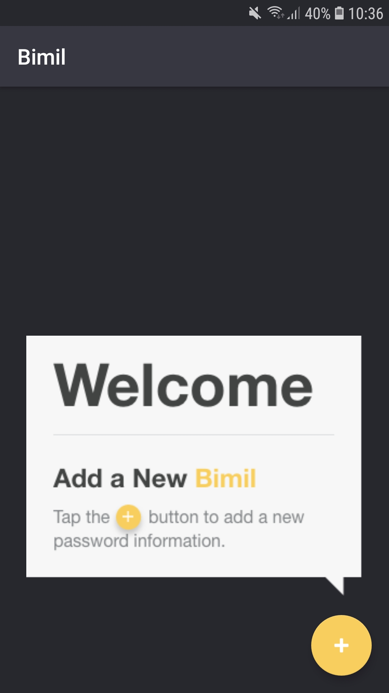
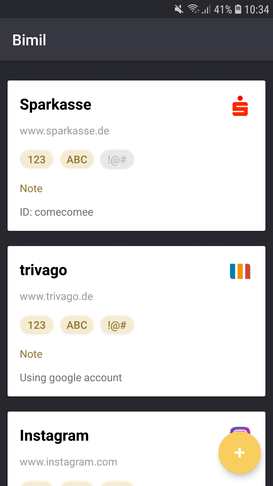
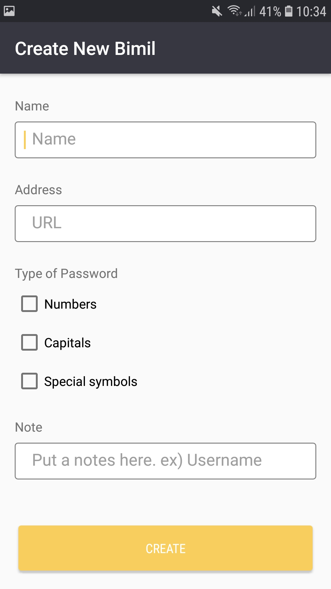

 

# Bimil-android

Bimil, safe way to remember password.  
Bimil means the secret in Korean.  
This app is used to remember password by some hints. 
Many websites have different password requirements such as combination of number, capital letter, special character. 
Usually we forgot what they required and always find password again and again. 
The user may use specific password based on their requirements. 
Therefore, this app helps to remind the requirements at the website. 
Note that, Bimil doesn't require the password.  

## Screenshot
        

## Usage
It currently supports adding, deleting and editing.  
Adding a new Bimil (Secret) with adding button.  
Deleting a Bimil with long clicking item.  
Editing a Bimil with clicking item.  

## Requirements
minSdkVersion is 19 which is Android Kitkat.

I built this app to practice kotlin, room and MVVM.  
If there is any suggestion or feedback, please contact me <comecomee@gmail.com>  
